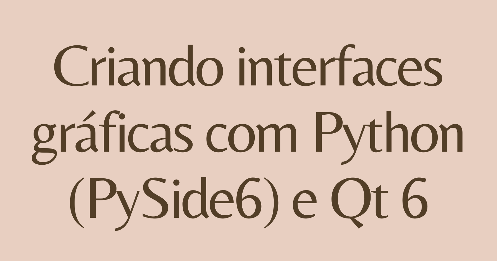

.. a documentation master file, created by
   sphinx-quickstart on Fri Sep 23 19:36:58 2022.
   You can adapt this file completely to your liking, but it should at least
   contain the root `toctree` directive.

:og:description: Site criado para documentar e centralizar conteúdos, dicas, tutoriais e exemplos de código sobre a construção de interfaces com a linguagem de programação Python (PyGObject) e o framework gráfico Qt 6.

.. meta::
   :description: Site criado para documentar e centralizar conteúdos, dicas, tutoriais e exemplos de código sobre a construção de interfaces com a linguagem de programação Python (PyGObject) e o framework gráfico Qt 6.
   :keywords: Qt, Qt 6, PySide, PySide6, Python, Python 3, XML, QML, Kirigami

Criando interfaces gráficas com Python (PySide6) e Qt 6
=======================================================

Descrição
---------

Site criado para documentar e centralizar conteúdos, dicas, tutoriais e exemplos de código sobre a construção de interfaces gráficas com a linguagem de programação Python (PySide6) e o framework gráfico Qt 6.

--------------

Autor
=====

Feito com 💙 por `Renato Cruz <https://github.com/natorsc>`__ 🤜🤛 Entre em contato!

|E-mail| |LinkedIn|

Uma das playlist que costumo ouvir quando estou estudando ou "codando" 😁:

|Spotify|

Sempre que possível escrevo tutoriais no meu blog pessoal 🚀:

|Blog|

.. |E-mail| image:: https://img.shields.io/static/v1?label=&message=E-mail&color=blueviolet&logoColor=white&logo=gmail
   :target: mailto:zkpcvm6dz@mozmail.com
.. |LinkedIn| image:: https://img.shields.io/static/v1?label=&message=LinkedIn&color=blue&logoColor=white&logo=LinkedIn
   :target: https://www.linkedin.com/in/natorsc
.. |Spotify| image:: https://img.shields.io/static/v1?label=&message=Spotify&color=darkgreen&logoColor=white&logo=spotify
   :target: https://open.spotify.com/playlist/1xf3u29puXlnrWO7MsaHL5?si=A-LgwRJXSvOno_e6trpi5w&utm_source=copy-link
.. |Blog| image:: https://img.shields.io/static/v1?label=&message=Blog&color=gray&logoColor=blue&logo=hashnode
   :target: https://blog.codigoninja.dev/

--------------

Doações
-------

Obrigado por sua doação é através dela que conseguimos manter este conteúdo 😊.

Ko-Fi
^^^^^

|Ko-Fi|

Pix
^^^

.. image:: ../images/donation/pix-qr-code.jpg
    :width: 300
    :alt: QR Code para doações via pix.

**Chave**: ``b1839493-2afe-484d-9272-82a3e402b36f``

.. |Ko-Fi| image:: https://img.shields.io/static/v1?label=&message=Ko-Fi&color=orange&logoColor=white&logo=ko-fi
   :target: https://ko-fi.com/natorsc

--------------

.. toctree::
   :maxdepth: 2
   :caption: Contents:

   tutorials
   tips
   pyside6-qml
   pyside6-qml-kirigami
   pyside6-widgets