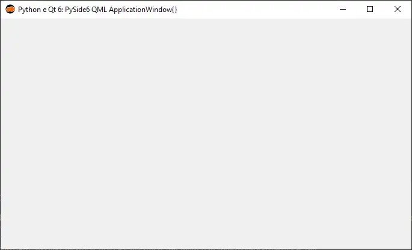
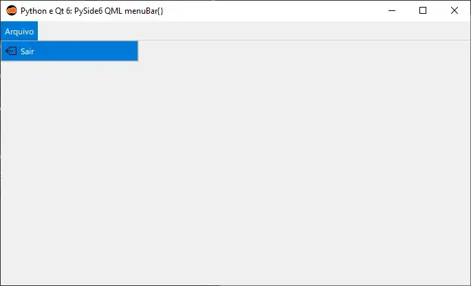
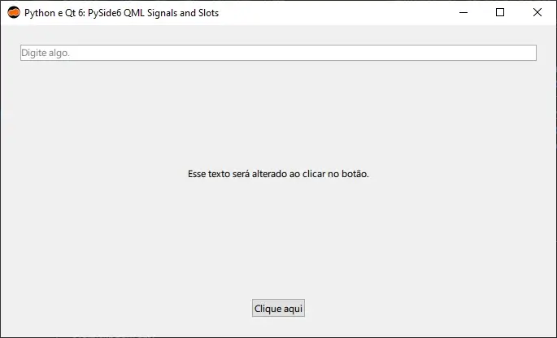
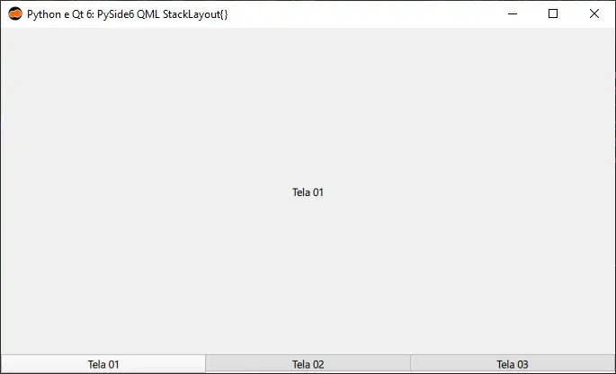
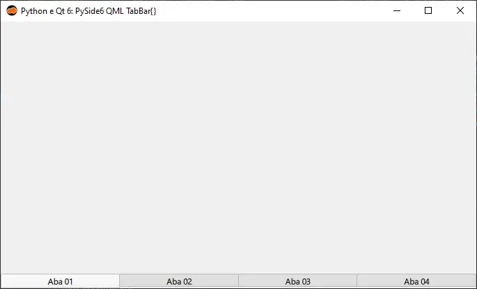
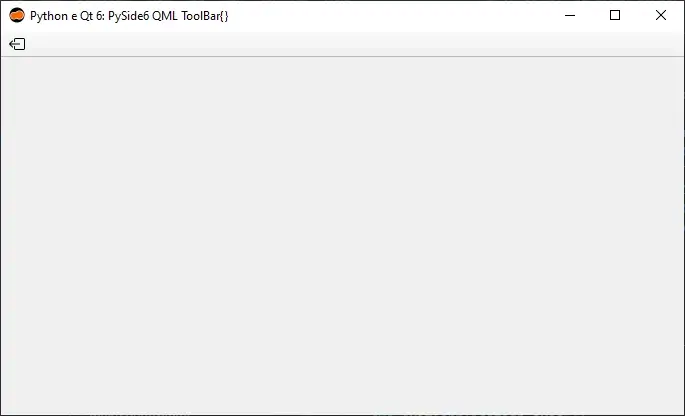

:og:description: Exemplos de código da utilização dos widgets QML do framework gráfico Qt 6 com a linguagem de programação Python (PySide6).

.. meta::
   :description: Exemplos de código da utilização dos widgets QML do framework gráfico Qt 6 com a linguagem de programação Python (PySide6).
   :keywords: Qt, Qt 6, PySide, PySide6, Python, Python 3, XML, QML, Kirigami

PySide6 QML
===========

ApplicationWindow
-----------------

   Python e Qt 6: PySide6 ApplicationWindow{}

.. tab:: Python

   ..  literalinclude:: ../../src/pyside6-qml/applicationwindow/MainWindow.py

.. tab:: QML

   ..  literalinclude:: ../../src/pyside6-qml/applicationwindow/MainWindow.qml

--------------

menuBar
-------

   Python e Qt 6: PySide6 menuBar{}

.. tab:: Python

   ..  literalinclude:: ../../src/pyside6-qml/menubar/MainWindow.py

.. tab:: QML

   ..  literalinclude:: ../../src/pyside6-qml/menubar/MainWindow.qml

--------------

Signals and Slots
-----------------

   Python e Qt 6: PySide6 Signals and Slots

.. tab:: Python

   ..  literalinclude:: ../../src/pyside6-qml/signals-and-slots/MainWindow.py

.. tab:: QML

   ..  literalinclude:: ../../src/pyside6-qml/signals-and-slots/MainWindow.qml

--------------

StackLayout
-----------

   Python e Qt 6: PySide6 StackLayout{}

.. tab:: Python

   ..  literalinclude:: ../../src/pyside6-qml/stacklayout/MainWindow.py

.. tab:: QML

   ..  literalinclude:: ../../src/pyside6-qml/stacklayout/MainWindow.qml

--------------

TabBar
------

   Python e Qt 6: PySide6 TabBar{}

.. tab:: Python

   ..  literalinclude:: ../../src/pyside6-qml/tabbar/MainWindow.py

.. tab:: QML

   ..  literalinclude:: ../../src/pyside6-qml/tabbar/MainWindow.qml

--------------

ToolBar
-------

   Python e Qt 6: PySide6 ToolBar{}

.. tab:: Python

   ..  literalinclude:: ../../src/pyside6-qml/toolbar/MainWindow.py

.. tab:: QML

      ..  literalinclude:: ../../src/pyside6-qml/toolbar/MainWindow.qml
