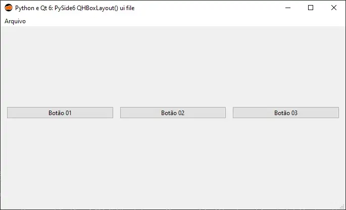
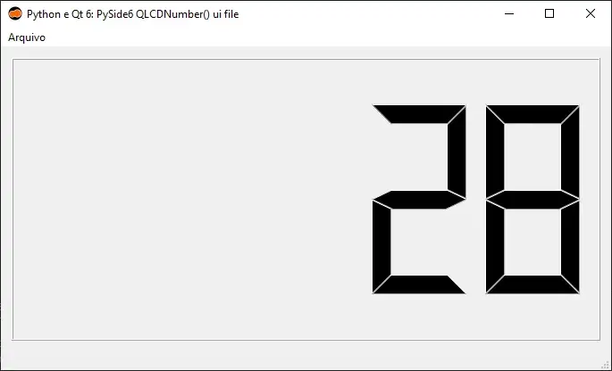
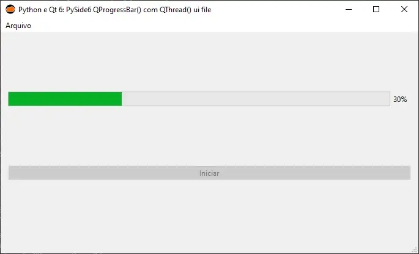
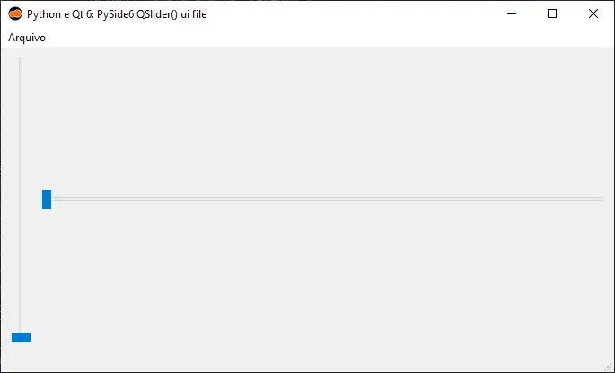

:og:description: Exemplos de código da utilização dos widgets XML do framework gráfico Qt 6 com a linguagem de programação Python (PySide6).

.. meta::
   :description: Exemplos de código da utilização dos widgets XML do framework gráfico Qt 6 com a linguagem de programação Python (PySide6).
   :keywords: Qt, Qt 6, PySide, PySide6, Python, Python 3, XML, QML, Kirigami

PySide6 widgets
===============

Drag and drop
-------------

   Python e Qt 6: PySide6 drag and drop

.. tab:: Python

   ..  literalinclude:: ../../src/pyside6-widgets/drag-and-drop/MainWindow.py

--------------

QCalendarWidget
---------------

   Python e Qt 6: PySide6 QCalendarWidget()

.. tab:: Python

   ..  literalinclude:: ../../src/pyside6-widgets/qcalendarwidget/MainWindow.py

.. tab:: Python loadUiType

   ..  literalinclude:: ../../src/pyside6-widgets/qcalendarwidget/ui/MainWindow_loadUiType.py
   
.. tab:: Python QUiLoader

   ..  literalinclude:: ../../src/pyside6-widgets/qcalendarwidget/ui/MainWindow_QUiLoader.py

.. tab:: XML

   ..  literalinclude:: ../../src/pyside6-widgets/qcalendarwidget/ui/MainWindow.ui
      :language: html

--------------

QCheckBox
---------

   Python e Qt 6: PySide6 QCheckBox()

.. tab:: Python

   ..  literalinclude:: ../../src/pyside6-widgets/qcheckbox/MainWindow.py

.. tab:: Python loadUiType

   ..  literalinclude:: ../../src/pyside6-widgets/qcalendarwidget/ui/MainWindow_loadUiType.py
   
.. tab:: Python QUiLoader

   ..  literalinclude:: ../../src/pyside6-widgets/qcalendarwidget/ui/MainWindow_QUiLoader.py

.. tab:: XML

   ..  literalinclude:: ../../src/pyside6-widgets/qcheckbox/ui/MainWindow.ui
      :language: html

--------------

QComboBox
---------

   Python e Qt 6: PySide6 QComboBox()

.. tab:: Python

   ..  literalinclude:: ../../src/pyside6-widgets/qlocale/MainWindow.py

.. tab:: Python loadUiType

   ..  literalinclude:: ../../src/pyside6-widgets/qcalendarwidget/ui/MainWindow_loadUiType.py
   
.. tab:: Python QUiLoader

   ..  literalinclude:: ../../src/pyside6-widgets/qcalendarwidget/ui/MainWindow_QUiLoader.py

.. tab:: XML

   ..  literalinclude:: ../../src/pyside6-widgets/qcombobox/ui/MainWindow.ui
      :language: html

--------------

QDateTimeEdit
-------------

   Python e Qt 6: PySide6 QDateTimeEdit()

.. tab:: Python

   ..  literalinclude:: ../../src/pyside6-widgets/qdatetimeedit/MainWindow.py

.. tab:: Python loadUiType

   ..  literalinclude:: ../../src/pyside6-widgets/qcalendarwidget/ui/MainWindow_loadUiType.py
   
.. tab:: Python QUiLoader

   ..  literalinclude:: ../../src/pyside6-widgets/qcalendarwidget/ui/MainWindow_QUiLoader.py

.. tab:: XML

   ..  literalinclude:: ../../src/pyside6-widgets/qcalendarwidget/ui/MainWindow.ui
      :language: html

--------------

QDial
-----

   Python e Qt 6: PySide6 QDial()

.. tab:: Python

   ..  literalinclude:: ../../src/pyside6-widgets/qdial/MainWindow.py

.. tab:: Python loadUiType

   ..  literalinclude:: ../../src/pyside6-widgets/qdial/ui/MainWindow_loadUiType.py
   
.. tab:: Python QUiLoader

   ..  literalinclude:: ../../src/pyside6-widgets/qdial/ui/MainWindow_QUiLoader.py

.. tab:: XML

   ..  literalinclude:: ../../src/pyside6-widgets/qdial/ui/MainWindow.ui
      :language: html

--------------

QFileDialog file
----------------

   Python e Qt 6: PySide6 QFileDialog() file

.. tab:: Python

   ..  literalinclude:: ../../src/pyside6-widgets/qfiledialog-file/MainWindow.py

--------------

QFileDialog folder
------------------

   Python e Qt 6: PySide6 QFileDialog() folder

.. tab:: Python

   ..  literalinclude:: ../../src/pyside6-widgets/qfiledialog-folder/MainWindow.py

--------------

QFileDialog save
----------------

   Python e Qt 6: PySide6 QFileDialog() save

.. tab:: Python

   ..  literalinclude:: ../../src/pyside6-widgets/qfiledialog-save/MainWindow.py

--------------

QFormLayout
-----------

   Python e Qt 6: PySide6 QFormLayout()

.. tab:: Python

   ..  literalinclude:: ../../src/pyside6-widgets/qformlayout/MainWindow.py

.. tab:: Python loadUiType

   ..  literalinclude:: ../../src/pyside6-widgets/qformlayout/ui/MainWindow_loadUiType.py
   
.. tab:: Python QUiLoader

   ..  literalinclude:: ../../src/pyside6-widgets/qformlayout/ui/MainWindow_QUiLoader.py

.. tab:: XML

   ..  literalinclude:: ../../src/pyside6-widgets/qformlayout/ui/MainWindow.ui
      :language: html

--------------

QHBoxLayout
-----------

   Python e Qt 6: PySide6 QHBoxLayout()

.. tab:: Python

   ..  literalinclude:: ../../src/pyside6-widgets/qhboxlayout/MainWindow.py

.. tab:: Python loadUiType

   ..  literalinclude:: ../../src/pyside6-widgets/qhboxlayout/ui/MainWindow_loadUiType.py
   
.. tab:: Python QUiLoader

   ..  literalinclude:: ../../src/pyside6-widgets/qhboxlayout/ui/MainWindow_QUiLoader.py

.. tab:: XML

   ..  literalinclude:: ../../src/pyside6-widgets/qhboxlayout/ui/MainWindow.ui
      :language: html

--------------

QLabel
------

   Python e Qt 6: PySide6 QLabel()

.. tab:: Python

   ..  literalinclude:: ../../src/pyside6-widgets/qlabel/MainWindow.py

.. tab:: Python loadUiType

   ..  literalinclude:: ../../src/pyside6-widgets/qlabel/ui/MainWindow_loadUiType.py
   
.. tab:: Python QUiLoader

   ..  literalinclude:: ../../src/pyside6-widgets/qlabel/ui/MainWindow_QUiLoader.py

.. tab:: XML

   ..  literalinclude:: ../../src/pyside6-widgets/qlabel/ui/MainWindow.ui
      :language: html

--------------

QLCDNumber
----------

   Python e Qt 6: PySide6 QLCDNumber()

.. tab:: Python

   ..  literalinclude:: ../../src/pyside6-widgets/qlcdnumber/MainWindow.py

.. tab:: Python loadUiType

   ..  literalinclude:: ../../src/pyside6-widgets/qlcdnumber/ui/MainWindow_loadUiType.py
   
.. tab:: Python QUiLoader

   ..  literalinclude:: ../../src/pyside6-widgets/qlcdnumber/ui/MainWindow_QUiLoader.py

.. tab:: XML

   ..  literalinclude:: ../../src/pyside6-widgets/qlcdnumber/ui/MainWindow.ui
      :language: html

--------------

QListView
---------

   Python e Qt 6: PySide6 QListView()

.. tab:: Python

   ..  literalinclude:: ../../src/pyside6-widgets/qlistview/MainWindow.py

.. tab:: Python loadUiType

   ..  literalinclude:: ../../src/pyside6-widgets/qlistview/ui/MainWindow_loadUiType.py
   
.. tab:: Python QUiLoader

   ..  literalinclude:: ../../src/pyside6-widgets/qlistview/ui/MainWindow_QUiLoader.py

.. tab:: XML

   ..  literalinclude:: ../../src/pyside6-widgets/qlistview/ui/MainWindow.ui
      :language: html

--------------

QListWidget
-----------

   Python e Qt 6: PySide6 QListWidget()

.. tab:: Python

   ..  literalinclude:: ../../src/pyside6-widgets/qlistwidget/MainWindow.py

.. tab:: Python loadUiType

   ..  literalinclude:: ../../src/pyside6-widgets/qlistwidget/ui/MainWindow_loadUiType.py
   
.. tab:: Python QUiLoader

   ..  literalinclude:: ../../src/pyside6-widgets/qlistwidget/ui/MainWindow_QUiLoader.py

.. tab:: XML

   ..  literalinclude:: ../../src/pyside6-widgets/qlistwidget/ui/MainWindow.ui
      :language: html

--------------

QLocale
-------

   Python e Qt 6: PySide6 QLocale()

.. tab:: Python

   ..  literalinclude:: ../../src/pyside6-widgets/qlocale/MainWindow.py

.. tab:: Python loadUiType

   ..  literalinclude:: ../../src/pyside6-widgets/qlocale/ui/MainWindow_loadUiType.py
   
.. tab:: Python QUiLoader

   ..  literalinclude:: ../../src/pyside6-widgets/qlocale/ui/MainWindow_QUiLoader.py

.. tab:: XML

   ..  literalinclude:: ../../src/pyside6-widgets/qlocale/ui/MainWindow.ui
      :language: html

--------------

QMainWindow
-----------

   Python e Qt 6: PySide6 QMainWindow()

.. tab:: Python

   ..  literalinclude:: ../../src/pyside6-widgets/qmainwindow/MainWindow.py

.. tab:: Python loadUiType

   ..  literalinclude:: ../../src/pyside6-widgets/qmainwindow/ui/MainWindow_loadUiType.py
   
.. tab:: Python QUiLoader

   ..  literalinclude:: ../../src/pyside6-widgets/qmainwindow/ui/MainWindow_QUiLoader.py

.. tab:: XML

   ..  literalinclude:: ../../src/pyside6-widgets/qmainwindow/ui/MainWindow.ui
      :language: html

--------------

QMenuBar
--------

   Python e Qt 6: PySide6 QMenuBar()

.. tab:: Python

   ..  literalinclude:: ../../src/pyside6-widgets/qmenubar/MainWindow.py

.. tab:: Python loadUiType

   ..  literalinclude:: ../../src/pyside6-widgets/qmenubar/ui/MainWindow_loadUiType.py
   
.. tab:: Python QUiLoader

   ..  literalinclude:: ../../src/pyside6-widgets/qmenubar/ui/MainWindow_QUiLoader.py

.. tab:: XML

   ..  literalinclude:: ../../src/pyside6-widgets/qmenubar/ui/MainWindow.ui
      :language: html

--------------

QPrintDialog
------------

   Python e Qt 6: PySide6 QPrintDialog()

.. tab:: Python

   ..  literalinclude:: ../../src/pyside6-widgets/qprintdialog/MainWindow.py

--------------

QProgressBar (QThread)
----------------------

   Python e Qt 6: PySide6 QProgressBar() com QThread()

.. tab:: Python

   ..  literalinclude:: ../../src/pyside6-widgets/qprogressbar-qtread/MainWindow.py

.. tab:: Python loadUiType

   ..  literalinclude:: ../../src/pyside6-widgets/qprogressbar-qtread/ui/MainWindow_loadUiType.py
   
.. tab:: Python QUiLoader

   ..  literalinclude:: ../../src/pyside6-widgets/qprogressbar-qtread/ui/MainWindow_QUiLoader.py

.. tab:: XML

   ..  literalinclude:: ../../src/pyside6-widgets/qprogressbar-qtread/ui/MainWindow.ui
      :language: html

--------------

QPushButton
-----------

   Python e Qt 6: PySide6 QPushButton()

.. tab:: Python

   ..  literalinclude:: ../../src/pyside6-widgets/qpushbutton/MainWindow.py

.. tab:: Python loadUiType

   ..  literalinclude:: ../../src/pyside6-widgets/qpushbutton/ui/MainWindow_loadUiType.py
   
.. tab:: Python QUiLoader

   ..  literalinclude:: ../../src/pyside6-widgets/qpushbutton/ui/MainWindow_QUiLoader.py

.. tab:: XML

   ..  literalinclude:: ../../src/pyside6-widgets/qpushbutton/ui/MainWindow.ui
      :language: html

--------------

QRadioButton
------------

   Python e Qt 6: PySide6 QRadioButton()

.. tab:: Python

   ..  literalinclude:: ../../src/pyside6-widgets/qradiobutton/MainWindow.py

.. tab:: Python loadUiType

   ..  literalinclude:: ../../src/pyside6-widgets/qradiobutton/ui/MainWindow_loadUiType.py
   
.. tab:: Python QUiLoader

   ..  literalinclude:: ../../src/pyside6-widgets/qradiobutton/ui/MainWindow_QUiLoader.py

.. tab:: XML

   ..  literalinclude:: ../../src/pyside6-widgets/qradiobutton/ui/MainWindow.ui
      :language: html

--------------

QScrollArea
-----------

   Python e Qt 6: PySide6 QScrollArea()

.. tab:: Python

   ..  literalinclude:: ../../src/pyside6-widgets/qscrollarea/MainWindow.py

.. tab:: Python loadUiType

   ..  literalinclude:: ../../src/pyside6-widgets/qscrollarea/ui/MainWindow_loadUiType.py
   
.. tab:: Python QUiLoader

   ..  literalinclude:: ../../src/pyside6-widgets/qscrollarea/ui/MainWindow_QUiLoader.py

.. tab:: XML

   ..  literalinclude:: ../../src/pyside6-widgets/qscrollarea/ui/MainWindow.ui
      :language: html

--------------

QScrollBar
----------

.. figure:: ../images/pyside6-widgets/pyside6-qscrollbar.webp
   :alt: Python e Qt 6: PySide6 QScrollBar()

   Python e Qt 6: PySide6 QScrollBar()

.. tab:: Python

   ..  literalinclude:: ../../src/pyside6-widgets/qscrollbar/MainWindow.py

.. tab:: Python loadUiType

   ..  literalinclude:: ../../src/pyside6-widgets/qscrollbar/ui/MainWindow_loadUiType.py
   
.. tab:: Python QUiLoader

   ..  literalinclude:: ../../src/pyside6-widgets/qscrollbar/ui/MainWindow_QUiLoader.py

.. tab:: XML

   ..  literalinclude:: ../../src/pyside6-widgets/qscrollbar/ui/MainWindow.ui
      :language: html

--------------

QSlider
-------

   Python e Qt 6: PySide6 QSlider()

.. tab:: Python

   ..  literalinclude:: ../../src/pyside6-widgets/qslider/MainWindow.py

.. tab:: Python loadUiType

   ..  literalinclude:: ../../src/pyside6-widgets/qslider/ui/MainWindow_loadUiType.py
   
.. tab:: Python QUiLoader

   ..  literalinclude:: ../../src/pyside6-widgets/qslider/ui/MainWindow_QUiLoader.py

.. tab:: XML

   ..  literalinclude:: ../../src/pyside6-widgets/qslider/ui/MainWindow.ui
      :language: html

--------------

QStackedLayout
--------------

   Python e Qt 6: PySide6 QStackedLayout()

.. tab:: Python

   ..  literalinclude:: ../../src/pyside6-widgets/qstackedlayout/MainWindow.py

--------------

QStackedWidget
--------------

   Python e Qt 6: PySide6 QSlider()

.. tab:: Python

   ..  literalinclude:: ../../src/pyside6-widgets/qstackedwidget/MainWindow.py

.. tab:: Python loadUiType

   ..  literalinclude:: ../../src/pyside6-widgets/qstackedwidget/ui/MainWindow_loadUiType.py
   
.. tab:: Python QUiLoader

   ..  literalinclude:: ../../src/pyside6-widgets/qstackedwidget/ui/MainWindow_QUiLoader.py

.. tab:: XML

   ..  literalinclude:: ../../src/pyside6-widgets/qstackedwidget/ui/MainWindow.ui
      :language: html

--------------

QStatusBar
----------

   Python e Qt 6: PySide6 QStatusBar()

.. tab:: Python

   ..  literalinclude:: ../../src/pyside6-widgets/qstatusbar/MainWindow.py

.. tab:: Python loadUiType

   ..  literalinclude:: ../../src/pyside6-widgets/qstatusbar/ui/MainWindow_loadUiType.py
   
.. tab:: Python QUiLoader

   ..  literalinclude:: ../../src/pyside6-widgets/qstatusbar/ui/MainWindow_QUiLoader.py

.. tab:: XML

   ..  literalinclude:: ../../src/pyside6-widgets/qstatusbar/ui/MainWindow.ui
      :language: html

--------------

QTableWidget
------------

   Python e Qt 6: PySide6 QTableWidget()

.. tab:: Python

   ..  literalinclude:: ../../src/pyside6-widgets/qtablewidget/MainWindow.py

.. tab:: Python loadUiType

   ..  literalinclude:: ../../src/pyside6-widgets/qtablewidget/ui/MainWindow_loadUiType.py
   
.. tab:: Python QUiLoader

   ..  literalinclude:: ../../src/pyside6-widgets/qtablewidget/ui/MainWindow_QUiLoader.py

.. tab:: XML

   ..  literalinclude:: ../../src/pyside6-widgets/qtablewidget/ui/MainWindow.ui
      :language: html

--------------

QTabWidget
----------

   Python e Qt 6: PySide6 QTabWidget()

.. tab:: Python

   ..  literalinclude:: ../../src/pyside6-widgets/qtabwidget/MainWindow.py

.. tab:: Python loadUiType

   ..  literalinclude:: ../../src/pyside6-widgets/qtabwidget/ui/MainWindow_loadUiType.py
   
.. tab:: Python QUiLoader

   ..  literalinclude:: ../../src/pyside6-widgets/qtabwidget/ui/MainWindow_QUiLoader.py

.. tab:: XML

   ..  literalinclude:: ../../src/pyside6-widgets/qtabwidget/ui/MainWindow.ui
      :language: html

--------------

QTimer
------

   Python e Qt 6: PySide6 QTimer()

.. tab:: Python

   ..  literalinclude:: ../../src/pyside6-widgets/qtimer/MainWindow.py

.. tab:: Python loadUiType

   ..  literalinclude:: ../../src/pyside6-widgets/qtimer/ui/MainWindow_loadUiType.py
   
.. tab:: Python QUiLoader

   ..  literalinclude:: ../../src/pyside6-widgets/qtimer/ui/MainWindow_QUiLoader.py

.. tab:: XML

   ..  literalinclude:: ../../src/pyside6-widgets/qtimer/ui/MainWindow.ui
      :language: html

--------------

QToolBar
--------

   Python e Qt 6: PySide6 QToolBar()

.. tab:: Python

   ..  literalinclude:: ../../src/pyside6-widgets/qtoolbar/MainWindow.py

.. tab:: Python loadUiType

   ..  literalinclude:: ../../src/pyside6-widgets/qtoolbar/ui/MainWindow_loadUiType.py
   
.. tab:: Python QUiLoader

   ..  literalinclude:: ../../src/pyside6-widgets/qtoolbar/ui/MainWindow_QUiLoader.py

.. tab:: XML

   ..  literalinclude:: ../../src/pyside6-widgets/qtoolbar/ui/MainWindow.ui
      :language: html

--------------

QTranslator
-----------

   Python e Qt 6: PySide6 QTranslator() e translate

.. tab:: Python

   ..  literalinclude:: ../../src/pyside6-widgets/qtranslator/MainWindow.py

.. tab:: Python loadUiType

   ..  literalinclude:: ../../src/pyside6-widgets/qtranslator/ui/MainWindow_loadUiType.py
   
.. tab:: Python QUiLoader

   ..  literalinclude:: ../../src/pyside6-widgets/qtranslator/ui/MainWindow_QUiLoader.py

.. tab:: XML

   ..  literalinclude:: ../../src/pyside6-widgets/qtranslator/ui/MainWindow.ui
      :language: html

--------------

QVBoxLayout
-----------

   Python e Qt 6: PySide6 QVBoxLayout()

.. tab:: Python

   ..  literalinclude:: ../../src/pyside6-widgets/qvboxlayout/MainWindow.py

.. tab:: Python loadUiType

   ..  literalinclude:: ../../src/pyside6-widgets/qvboxlayout/ui/MainWindow_loadUiType.py
   
.. tab:: Python QUiLoader

   ..  literalinclude:: ../../src/pyside6-widgets/qvboxlayout/ui/MainWindow_QUiLoader.py

.. tab:: XML

   ..  literalinclude:: ../../src/pyside6-widgets/qvboxlayout/ui/MainWindow.ui
      :language: html

--------------

Signals and Slots
-----------------

   Python e Qt 6: PySide6 signals and slots

.. tab:: Python

   ..  literalinclude:: ../../src/pyside6-widgets/signals-and-slots/MainWindow.py

.. tab:: Python loadUiType

   ..  literalinclude:: ../../src/pyside6-widgets/signals-and-slots/ui/MainWindow_loadUiType.py
   
.. tab:: Python QUiLoader

   ..  literalinclude:: ../../src/pyside6-widgets/signals-and-slots/ui/MainWindow_QUiLoader.py

.. tab:: XML

   ..  literalinclude:: ../../src/pyside6-widgets/signals-and-slots/ui/MainWindow.ui
      :language: html
