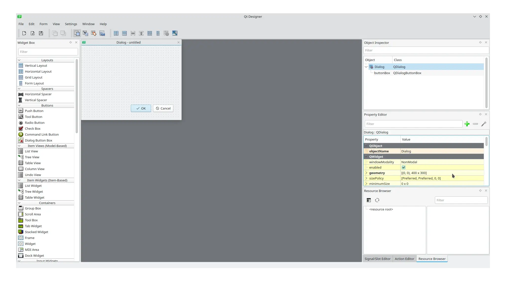
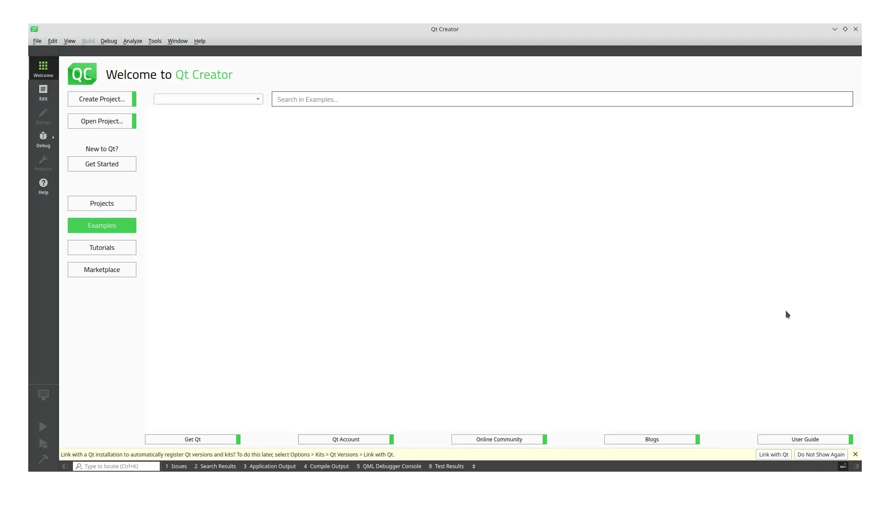

:og:description: Dicas de softwares e links úteis sobre a linguagem de programação Python e GTK 4.

.. meta::
   :description: Dicas de softwares e links úteis sobre a linguagem de programação Python e GTK 4.
   :keywords: Qt, Qt 6, PySide, PySide6, Python, Python 3, XML, QML, Kirigami

Dicas
=====

RADs
----

Qt Designer
^^^^^^^^^^^

   Qt Designer

-  `Qt Designer <https://doc.qt.io/qt-5/qtdesigner-manual.html>`__.

--------------

Qt Design Studio
^^^^^^^^^^^^^^^^

-  `Qt Design Studio (QML) <https://www.qt.io/product/ui-design-tools>`__.

--------------

IDEs
----

Qt Creator
^^^^^^^^^^

   Qt Creator

-  `Qt Creator <https://www.qt.io/product/development-tools>`__.
